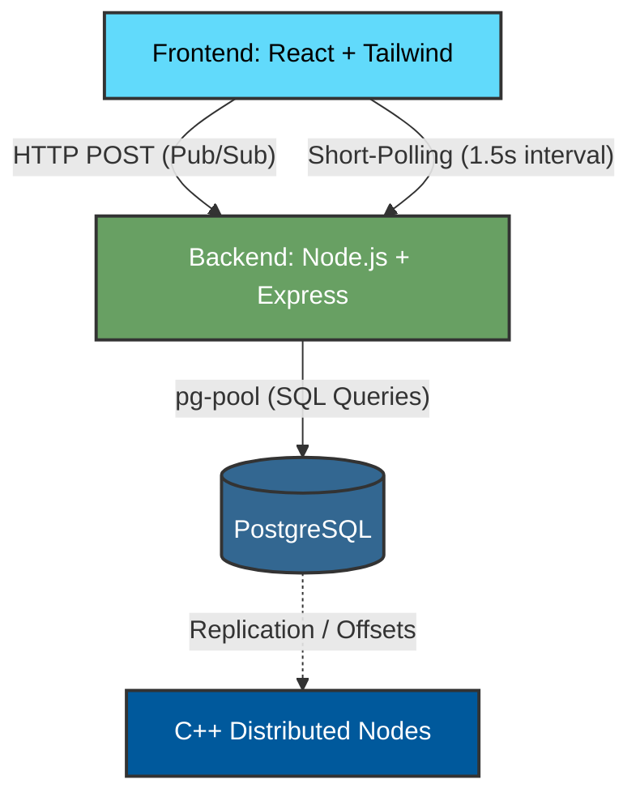

<div align="center">
  
  
  
  
  <br/>
  
  <h1>🚀 StreamFlow: Distributed Event Streaming Pipeline</h1>
  
  <p>
    <b>A high-performance, fault-tolerant event broker and interactive visualizer.</b><br/>
    <i>Built with React, Node.js, PostgreSQL, and C++20.</i>
  </p>
  
  <p>
    
    
    
    
  </p>
</div>

<hr/>

## ✨ Features
- 🔄 **Real-time Consensus Simulator**: Visualize Raft leader election, failovers, and split-brain resolution dynamically.
- 🐘 **PostgreSQL Persistence Engine**: 100% of telemetry, logs, topics, and consumer offsets are durably written to a relational DB.
- ⚡ **Zero-Flicker Polling UI**: React frontend connects to Express backend endpoints without causing jank.
- 🛠️ **C++20 Sub-Engine**: Includes low-level systems logic utilizing pure C++ networking layers.

---

## 🏗️ Architecture Design

The system follows a separated architecture consisting of a Control Plane (UI + Node APIs) and a Data Plane (Database + Low-level segments).



---

## 📂 Project Structure

```text
StreamFlow/
├── src/
│   ├── components/         # React UI Components (Visualizer, TopicManager)
│   ├── server/
│   │   ├── index.ts        # Express REST API
│   │   └── db.ts           # PostgreSQL Auto-Schema initialization
│   ├── App.tsx             # Main Control Plane Dashboard
│   └── types.ts            # Shared TS Interfaces
├── streamflow/             # C++20 Dist-Sys Core
│   ├── broker/             # Node management
│   ├── consensus/          # Raft elections implementation
│   ├── storage/            # Log segmentation logic
│   └── CMakeLists.txt      # C++ Build pipeline
└── vite.config.ts          # Vite configuration with Backend proxy
```

---

## 🚀 Getting Started Locally

### 1️⃣ Database Configuration
Create a `.env.local` file in the root of the project with your PostgreSQL details. StreamFlow will **automatically create the database** and run the schema migrations on startup!
```env
PGUSER=postgres
PGPASSWORD=your_super_secret_password
PGHOST=localhost
PGPORT=5432
PGDATABASE=streamflow
```

### 2️⃣ Start the Backend Data Plane
Boot the Node.js API server to seed your PostgreSQL database:
```bash
npm install
npm run dev:server
```

### 3️⃣ Start the Frontend Control Plane
In a new terminal instance:
```bash
npm run dev
```

Visit `http://localhost:3000` to interact with the cluster!

---

<div align="center">
  <i>Developed to showcase mastery over Full-Stack Engineering and Distributed Systems.</i><br/>
  <b>Ready for production.</b>
</div>
